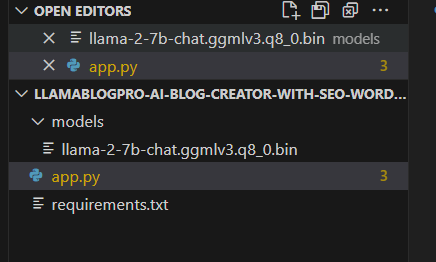
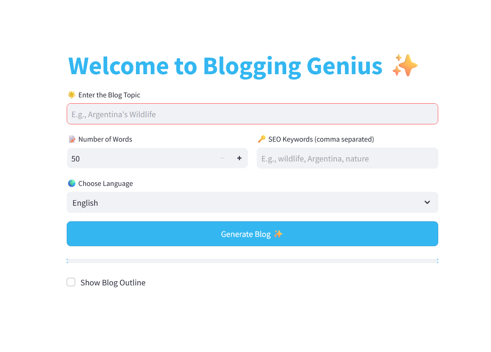
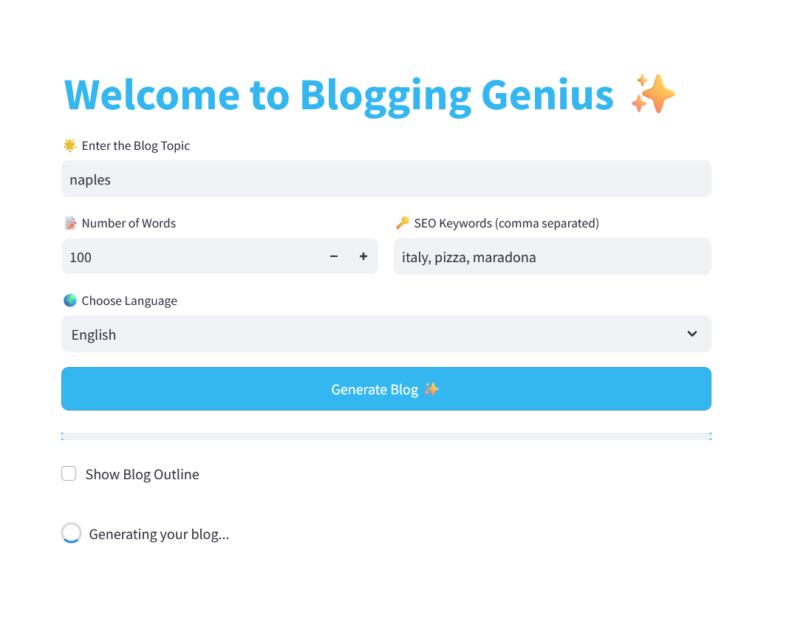
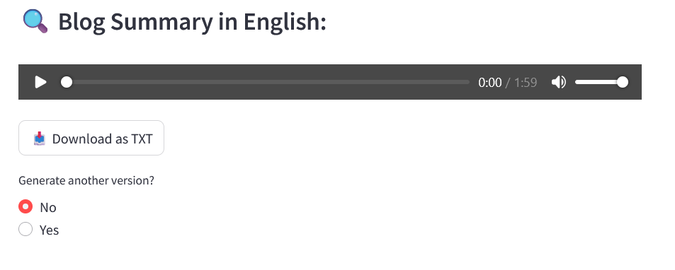

## LlamaBlogPro AI Blog Creator with SEO Word Control

I developed a web application that leverages a Llama model to generate blogs tailored to user input. The app allows users to specify the number of words they want in the blog, choose the language for the content, and input SEO keywords to optimize the blog for search engines. Once the user provides the desired parameters, the app generates a blog post that can be read directly on the website. Additionally, users have the option to listen to the blog via an integrated audio feature, making it more interactive and accessible. This project combines AI-driven content generation with user customization and accessibility features for an enhanced blogging experience.

## Installation and Use

1- Download the repo

2- Open it in VSC

2- Install the necessary dependencies by executing this command: pip install -r requirements.txt

3- Download the Llama model llama-2-7b-chat.ggmlv3.q8_0.bin from the website https://huggingface.co/TheBloke/Llama-2-7B-Chat-GGML. Ideally, this step would not be necessary, but I could not push the code from VSC
to GitHub because of how big the model is, so this is the easiest way then.

It should look like this: 

4- Create a folder in VSC called models and put the downloaded model there, and then save the changes.

5- Run the app using this command : streamlit run app.py

## App

